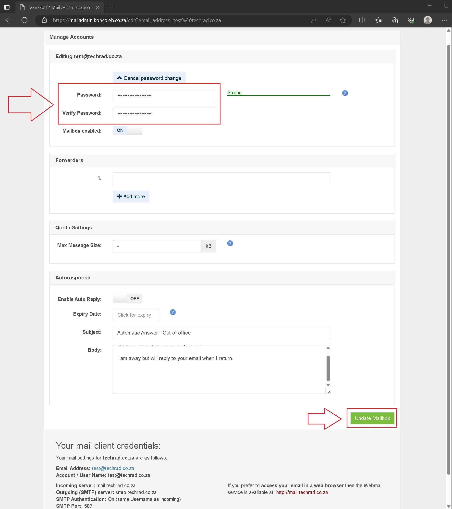

# How to change your Xneelo email password using mailadmin

Open your browser and go to the url: https://mailadmin.konsoleh.co.za

Enter your _email_ and _current password_, then click on the **Sign in** button.

Once logged in click on the change password dropdown box.

Enter your new password and verify your password in the two texboxes.

Scroll down to the bottom of the page and click on the Update Mailbox button.

You will now see the information alert `Mail details updated` confirming your password update.

You can now close the browser.

