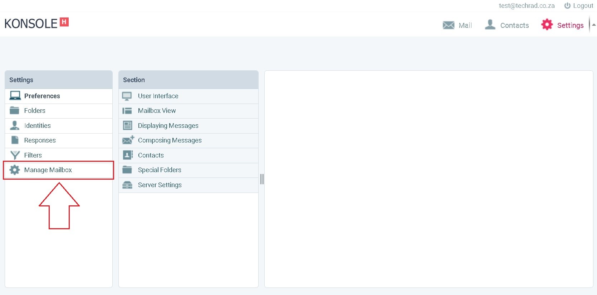

# How to change your Xneelo email password using webmail

Open your browser and go to the url: https://webmail.konsoleh.co.za/login

Enter your _email_ and _current password_, then click on the **webmail login** button.

Once you have logged in click on the settings button.

In the setting section click on the Manage Mailbox button.

Now fill in your email and current password then click on the sign in button.

Under the Manage Accounts > Editing youremail click on the change password dropdown box.

Enter your new password and verify your password in the two texboxes.

Scroll down to the bottom of the page and click on the Update Mailbox button.

You will now see the information alert `Mail details updated` confirming your password update.

